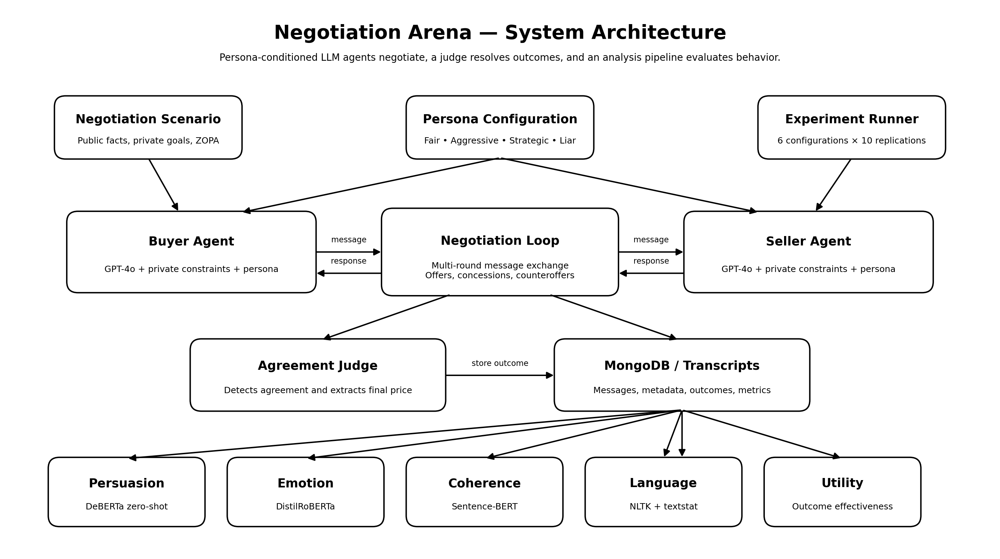

# Negotiation Arena

<p align="center">
  <strong>An experimental framework for studying negotiation strategies and emergent behavior in LLM-based multi-agent systems.</strong>
</p>

<p align="center">
  <a href="#quick-start">Quick Start</a> •
  <a href="#experimental-design">Experiment</a> •
  <a href="#results">Results</a> •
  <a href="#repository-structure">Structure</a>
</p>

<p align="center">
  
</p>

## Research Question

**Do large language models adapt strategically during negotiation, or do they primarily reproduce learned conversational patterns?**

Negotiation Arena places autonomous LLM agents in strategic bargaining scenarios with conflicting goals and incomplete information. It evaluates how persona conditioning influences agreement, persuasion, cooperation, compromise, emotional tone, linguistic complexity, coherence, and utility.

## Highlights

- Two autonomous GPT-4o agents negotiate over multiple rounds.
- Agents receive distinct personas, goals, and private constraints.
- Six persona configurations are evaluated across 60 negotiations.
- A judge model detects agreement and extracts negotiated outcomes.
- Automated analyzers measure persuasion, emotion, semantic coherence, language complexity, concession behavior, and utility.
- A Streamlit interface supports interactive exploration and transcript inspection.

## Experimental Design

| Component | Configuration |
|---|---|
| Domain | Used-car sale |
| Item | 2018 Honda Civic |
| Agents | Buyer and seller |
| Model | GPT-4o |
| Persona configurations | 6 |
| Replications per configuration | 10 |
| Total negotiations | 60 |
| ZOPA | \$720–\$750 |

The evaluated persona set includes **Fair**, **Aggressive**, **Strategic**, **Liar**, and **None**, combined into six buyer–seller configurations.

## Evaluation Pipeline

The system evaluates each negotiation using complementary behavioral and outcome measures:

| Dimension | Method |
|---|---|
| Persuasion tactics | DeBERTa zero-shot classification |
| Emotional tone | DistilRoBERTa emotion classification |
| Logical coherence | Sentence-BERT semantic similarity |
| Language complexity | NLTK and textstat |
| Concession behavior | Offer and price trajectory analysis |
| Utility | Outcome-based utility calculation |
| Agreement detection | LLM judge with structured output |

## Results

### Negotiation Outcomes

| Persona Pair | Agreement Rate | Average Rounds | Compromise |
|---|---:|---:|---:|
| Fair vs Fair | 100% | 5.3 | 4.2 |
| Aggressive vs Aggressive | 90% | 8.1 | 4.7 |
| Liar vs Fair | 80% | 8.0 | 5.4 |

### Utility by Persona

| Persona | Mean Utility | Standard Deviation | N |
|---|---:|---:|---:|
| Liar | 0.48 | 0.24 | 8 |
| Aggressive | 0.29 | 0.19 | 37 |
| Fair | 0.13 | 0.16 | 37 |
| Strategic | 0.00 | 0.00 | 10 |

### Main Observations

- Agreement rates ranged from **80% to 100%** across the reported configurations.
- Persona conditioning produced distinct negotiation trajectories and utility outcomes.
- Compromise was the most frequent observed strategy.
- Negotiations remained semantically coherent, with average coherence scores around **0.72–0.76**.
- Price trajectories showed strong convergence within the defined bargaining range.
- Deception and pressure tactics were not detected by the employed classifiers.

These findings are consistent with **persona-dependent adaptive behavior**, but they do not establish that the agents perform genuine reasoning. The results may also reflect sophisticated pattern completion, prompt conditioning, and model-alignment effects.

Full result tables are available in:

- `table1_strategies.csv`
- `table2_emotions.csv`
- `table3_coherence.csv`
- `table4_utility.csv`
- `table5_language_complexity.csv`

The complete academic report is available in `FINAL_REPORT_CONDENSED.tex`.

## Quick Start

### Prerequisites

- Python 3.10+
- MongoDB, either local or cloud-hosted
- An OpenAI API key

### Installation

```bash
git clone https://github.com/4lirastegar/Negotiation-Arena.git
cd Negotiation-Arena

python3 -m venv venv
source venv/bin/activate
# Windows: venv\Scripts\activate

pip install -r requirements.txt
cp env.template .env
```

Add your credentials to `.env`:

```env
OPENAI_API_KEY=your_openai_api_key
MONGO_URI=mongodb://localhost:27017/
MONGO_DB_NAME=negotiation
```

The first analysis run downloads the required Hugging Face and NLTK resources.

### Launch the Interactive Interface

```bash
streamlit run app.py
```

The application allows you to:

- run individual negotiations,
- select persona configurations,
- inspect message exchanges in real time,
- review qualitative metrics,
- and download negotiation transcripts.

### Reproduce the Full Experiment

```bash
python3 run_batch_tests.py
```

This executes 10 replications for each of the six persona configurations and stores the results in MongoDB.

### Generate Result Tables

```bash
python3 analysis/create_report_tables.py
python3 analysis/create_language_complexity_table.py
```

## Repository Structure

```text
Negotiation-Arena/
├── agents/
│   ├── agent.py
│   └── judge.py
├── analysis/
│   ├── qualitative_metrics.py
│   ├── persuasion_tactics.py
│   ├── emotional_tone.py
│   ├── logical_coherence.py
│   ├── language_metrics.py
│   ├── create_report_tables.py
│   └── create_language_complexity_table.py
├── config/
│   └── config.py
├── docs/
│   └── images/
│       └── architecture.png
├── personas/
│   └── persona_configs.py
├── scenarios/
│   └── used_car_sale.json
├── simulation/
│   └── realtime_negotiation.py
├── utils/
│   ├── mongodb_client.py
│   └── scenario_loader.py
├── app.py
├── run_batch_tests.py
├── requirements.txt
├── env.template
├── FINAL_REPORT_CONDENSED.tex
└── table*.csv
```

## Limitations

- The study uses a single negotiation domain.
- The dataset contains 60 negotiations, limiting statistical power.
- The agents primarily use one model family.
- Persona effects may depend strongly on prompt design.
- Automated classifiers can introduce measurement error.
- The absence of detected deception does not prove that deceptive behavior is impossible or absent.
- The experiments do not provide a definitive test of genuine reasoning.

## Future Work

- Evaluate multiple model families and model sizes.
- Add negotiation domains beyond price bargaining.
- Increase the number of replications.
- Compare fixed personas with dynamically adapting agents.
- Add human evaluation of strategy, coherence, and persuasiveness.
- Study tool-using and memory-augmented negotiation agents.
- Introduce reproducible statistical significance testing.

## Citation

```bibtex
@misc{rastegar2026negotiationarena,
  title  = {Negotiation Arena: Emergent Negotiation Strategies in LLM-Based Multi-Agent Systems},
  author = {Rastegar Mojarad, Ali},
  year   = {2026},
  note   = {University of Milan}
}
```

## Author

**Ali Rastegar Mojarad**  
Department of Computer Science, University of Milan

- Portfolio: [4lirastegar.com](https://4lirastegar.com)
- GitHub: [@4lirastegar](https://github.com/4lirastegar)
- Email: [4lirastegar4li@gmail.com](mailto:4lirastegar4li@gmail.com)

## License

This repository is currently provided for educational and research use. Before wider reuse or external contributions, add a standard license such as MIT or Apache-2.0 and update this section accordingly.
